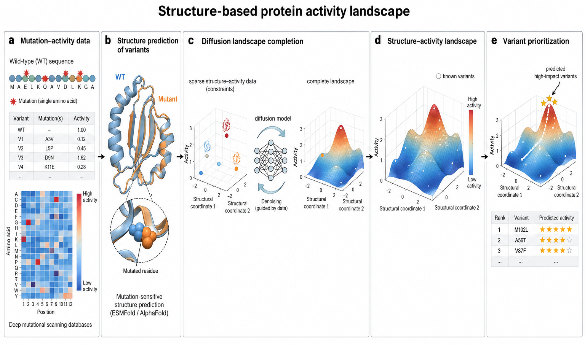

# TetR bile-acid biosensor

Computational analysis of directed evolution and ligand-dependent sequence–function landscapes.

**Current status → [STATUS.md](STATUS.md)**
**Evidence → [docs/EVIDENCE.md](docs/EVIDENCE.md)**
**Project page → https://feifeiyizhi.github.io/zsy-atf-biosensor/**

Code and reproducible outputs → [`work/`](work/)

The public mirror excludes raw sequencing reads, credentials, model weights, and other private or large artifacts.
