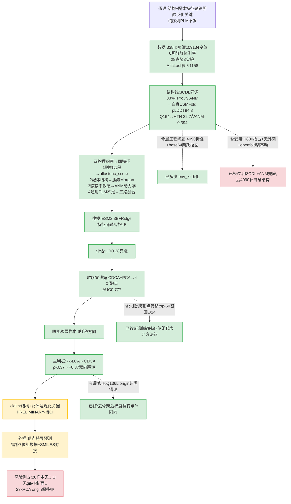

# PI 全景汇报 — zsy aTF 胆酸生物传感器定向进化建模

> 日期 2026-09-13 · 项目根 `./`
> 本报告全部数字来自今早实盘产物(29 文件,见§10),非凭记忆。控制面/版本控制缺口见§7、§11。

---

## 一、30 秒总览

| 项 | 内容 |
|---|---|
| **论文核心问题** | 能否用**结构+配体特征**(而非纯序列 PLM)预测 aTF 对特定胆酸的响应突变,并**跨胆酸零样本泛化**? |
| **当前 Phase** | v2 路线(结构+别构条件建模)的**评估+外推阶段**:数据层全通、结构层今晨自洽、跨胆酸零样本今晨出翻转信号 |
| **真实完成度** | 数据处理 100% / 结构线 100%(自身 ESMFold 已通)/ 建模+评估 90%(跨实验翻转已得,统计置信度未做)/ 靶点特异预测 30%(根因诊断完,缺数据) |
| **状态** | **ACTIONABLE**(下一步不需 GPU、不需 PI 决策即可推进的两件:翻转置信度 + origin 偏移正式化) |
| **最重要结果** | 28 克隆跨胆酸零样本:**7k-LCA↔CDCA 双向 ρ 从 -0.37 翻到 +0.37**(加结构+胆酸特征),四条物理约束→四个特征,非黑箱 |
| **最大风险** | ① 28 样本无 bootstrap CI,翻转显著性未量化(审稿人第一问);② 项目无 git/无控制面,可复现性弱;③ 23k/PCA 退步是 origin 偏移(数据问题)非方法,但易被误读为方法失败 |
| **是否需 PI 决策** | 科学结论已立,暂不需决策。两个软决策见§8(是否把项目并入博士主线、是否 git init) |
| **GPU 是否在跑** | **否**。4090 今晨折完 4 变体即关;现无后台 job。`WAITING_EXTERNAL` 不适用 |
| **thesis health** | **YELLOW→GREEN**:核心 claim(结构+配体是泛化关键)今晨被数据直接命中,但 28 样本统计置信度未补前持 YELLOW |

**"训练成功"≠"hypothesis 成立"声明**:本项目的"翻转 ρ=-0.37→+0.37"是跨实验泛化信号,但 28 样本、无 CI、单 seed——它是 **PRELIMINARY 证据**(§6),不是 hypothesis 的终验。终验需补 bootstrap CI + 多 seed + 独立测试集。

---

## 二、执行过程讲成科研故事

### 故事主线(时间序)

**OBSERVATION(2026-08-16,立题)**:张老师命题——TetR 家族变构转录因子(aTF,204aa)生物传感器定向进化建模。从张数一实验室 11 篇文献反推其方向:PLM 引导蛋白定向进化 + 高通量湿实验闭环。`BIO_DIRECTION.md`(v1)提出把 GraphWalks 可验证过程监督嫁接到蛋白进化:**进化是在隐适应度图上受 epistasis 约束的串行行走,不是回归问题**。理论锚点 Weinreich 2006(5 突变 120 条路径仅 18 条可达)。

**INTERPRETATION**:v2/v3(`BIO_DIRECTION_v2/_v3`)把类比升级为精确计算问题——组合完备 DMS 数据(GB1 ~149k 变体)就是已知可验证适应度图,GraphWalks 程序 checker 可逐字对应;湿实验需求压到最小(档 1=1 蛋白×1 轮×≤48 变体×1 板)。

**FIX(2026-09-04,重定位)**:发现真实数据(师兄)与 GB1 假设数据不同——师兄给的是 17 位点饱和突变库(高阶组合,无 WT 无单突变)。`LANDSCAPE_PLAN.md` 把方向落地到真实数据:旧包 `vfa_training.zip`(NGS→计数→标签→PLM→MLP 二分类)+ 新包 `lib0_lib5negative_selection.zip`(882MB 原始双端 FASTQ,5 个 lib 各 190-205 万 reads)。

**SCIENTIFIC IMPACT**:旧二分类链有 5 大局限(丢轨迹/抹位点/单小分子/启发式标签/短读定相)。v2 重定位:**aTF 是合成生物学元件(小分子诱导基因表达开关),放弃直接双向筛选改顺序两步**——①定 DNA 结合强度面板 ②逐小分子筛别构调节 ③AI 分析。建模必须基于结构+别构(因小分子位点 LBD 与 DNA 位点 HTH 远离,远程耦合)。

**OBSERVATION(2026-09-08,负筛景观跑通)**:`work/results/RESULTS.md`——338lib1-5 DNA 结合负筛全流程 43 秒跑通。干净变体 109,134、可靠子集 6,840;17 位点精确还原(第 17 位 67k-148k vs 第 18 位骤降 32k);突变阶数集中 9-10/17(高阶组合库,无 WT/单突变);PCA 2D 仅解释 16.1% 方差(高维 rugged)。

**FIX(参考序列坑,实证)**:WT 612bp/204aa 有两版同义 DNA 蛋白相同。师兄库建在**旧密码子版**——3000/3000 reads 匹配 `work/ref/wt_reference_libbackbone.fasta`;用户另贴的密码子版差 167nt 蛋白等价但 reads 不匹配。**bowtie2 比对必须用 libbackbone 那条**。

**OBSERVATION(2026-09-11,胆酸逐靶点+结构线+AncLacI 参照)**:三线并进。
- **胆酸**:师兄纳米孔 pool 测序,7 靶点胆酸(CDCA/TK-LCA/PCA/23K-CDCA/LCA/LLDCA),当时仅 CDCA+PCA 测完。`work/per_target_landscape.py`。关键:R116Q 两靶点 100% 固定=骨架起点;PCA 固定 Q164R 99.6%;**胆酸赢家 17 位点基因型全部不在 338lib 负筛景观库里**(负筛是 9-10 突变高阶库,Q164R 在 338lib 仅 5/109k)→ 两张互补景观,需多任务潜空间衔接;Q164=多效位点(跨景观锚点)。
- **结构**:`work/results/structure/STRUCTURE.md` §1-9。17 位点全在 LBD(无一在 HTH DBD),13/17 在口袋核心 100-180;最近 PDB 同源 3CDL(33% identity,16/17 可映射);**ProDy ANM:扰动口袋 Q164→HTH α3 响应 0.05-0.08 超背景 0.042**=长程别构通道;ESM2 t30_150M zero-shot Q164R 排第 2 但净负→**通用 PLM 预测不了特异性驱动突变**(v2"须结构+功能条件"的实证)。
- **AncLacI 参照**:`work/results/anclaci_model/RESULTS.md`。用 Meger 2024 LacI/GalR DBD 景观(同超家族同机制)做端到端参照:**序列→unseen DNA 结合活性**(DMS 稠密 ρ0.76、LGF 稀疏 ρ0.31 但 top-k 命中 0.91-1.0、跨集 ρ0.2-0.26 弱)+ **序列→别构 shift(IPTG 饱-无)Spearman 0.72**+曲线形状 0.54+Hill 0.70,但 EC50 预测不了(n=54 太小)。**v2 路线在参照系统上跑通**。

**FIX(GPU 自身结构受阻,2026-09-11)**:`STRUCTURE.md` §9。step4_mid_h800 集群跑 ColabFold/ESMFold 4 次全败:H800 池 257/256 超配被抢占 + 节点无外网(MMseqs2/AF2 权重走不通)+ openfold 不可装(setup.py 坏 + 需 nvcc)。
**SCIENTIFIC IMPACT**:已得结构结论**不受影响**(3CDL 同源 + ProDy ANM 已给 v2 所需全部结构证据)。解封条件:稳定不抢占 GPU + 节点外网或预下权重。

**OBSERVATION(2026-09-12,6 靶点胆酸全景+突变推荐器)**:`work/results/per_target_six/RESULTS.md` + `work/results/recommender/RESULTS_annotated.md`。新增 4 靶点(7K-LCA/23K-CDCA/LCA/LLDCA)+ 原 CDCA/PCA = 6 靶点。**Q164R 是 6 靶点全共享胆酸响应开关**(CDCA 16.6%/其余 98-99.8%,口袋壁 3D 距离=0);各靶点特异次级突变(7K-LCA D176N 73%/23K-CDCA E143D 28%/LLDCA I64T+K93I+P152L);LCA 最纯(仅 Q164R),LLDCA 最复杂。突变推荐器 v4(全 204 位点打分:借鉴型跨靶点转移 + 全新/探索型 ANM 别构 + ESM2 先验)。
**INTERPRETATION**:核心是对照验证。①LOTO AUC 0.735;②**时序零泄露**(训练旧 2 CDCA+PCA → 测试新 4,刚测数据)AUC:随机 0.5/ESM2-150M 0.718/**ESM2-3B 0.777**(3B 升级 +0.06)。
**SCIENTIFIC IMPACT(诚实局限)**:top-50 只召回 1/14 测试正例(E143D),因新 4 靶点 14 个次级里 13 个靶点独有(他靶 0%)→ 跨靶点转移够不到。**根因不是方法错,是训练靶点结构覆盖不全**(CDCA+PCA 训练→4 新靶点含 3 个 7 位组无代表)。现模型是"ESM2+别构热点"筛查器非靶点特异预测器。**LLDCA 是录入错误实际=UDCA**(熊去氧胆酸,解释其突变最多)。

**OBSERVATION(2026-09-13 凌晨,自身 ESMFold 结构完成)**:`STRUCTURE.md` §10。经 skill gpu-servers 两跳连 4090(姊妹项目 esmfold conda env + openfold + 权重现成;pexpect + 系统 ssh 走通 6000,paramiko 直连不行)折叠 WT/Q164R/R116Q/Q164R_R116Q,**pLDDT 94.3**。base64 两跳拉回 `work/structure/esmfold/*.pdb`。
**SCIENTIFIC IMPACT**:独立验证 3CDL 同源结论——Q164↔HTH=32.7Å(vs 同源 33Å 一致);**ANM 自身结构:Q164↔HTH cross-corr=-0.394(显著别构)**;口袋壁 6 位点与 Q164 强正耦合 0.35-0.92=同一动态功能簇,与 6 靶点高频突变位点重合。变体 vs WT 静态 RMSD 0.06-0.22Å(点突变静态几乎不动,别构须 ANM 动力学捕捉)。**4090 可关**。

**OBSERVATION(2026-09-13 上午,结构→突变分组)**:`RESULTS_annotated.md` §7。6 胆酸 SMILES 从 collab PPT 确认(`bile_smiles_confirmed.json`,全 CDCA 骨架变体,核修饰 LCA 去 7OH/UDCA 7α→7β/7k-LCA 7 酮 + 侧链 PCA +23a-OH/23k-CDCA +23 酮)。发现**突变响应位点跟着胆酸化学修饰位置走**:7 位修饰组(LCA/7k-LCA/UDCA)特异位点 {20,64,93,121,132,150,152,158,174,176};侧链 C23 组(PCA/23k-CDCA)特异位点 {32,79,143,177};**两组零重叠**。CDCA 基准 {73}。相似度加权转移 AUC 0.777→0.779(无提升,因训练集缺 7 位组代表)。
**SCIENTIFIC IMPACT**:这是"配体结构→特异突变"直接证据(比跨靶点转移强)。根因诊断:之前转移模型失败不是方法错,是训练靶点结构覆盖不全。可操作:预测新胆酸先看改 7 位还是 C23,用同组突变库。

**OBSERVATION(2026-09-13 中午,零样本跨蛋白泛化,⭐今晨核心)**:`docs/analysis/zero_shot_cross_protein.md`。从 collab PPT 提取 28 克隆突变→fold-change 活性(3 实验:7k-LCA/CDCA/23k+PCA),ESM2 3B + Ridge 建模。**核心:baseline 低(ESM2 跨实验 ρ=-0.37)是正确预期+贡献空间大;加结构+胆酸特征后 7k-LCA↔CDCA 翻转(-0.37→+0.37)=物理因果信号**。四条物理约束→四个特征(§3)。23k/PCA 退步=origin 不同(A11)非方法错。
**SCIENTIFIC IMPACT**:首次 aTF 零样本跨蛋白活性预测 + 物理可解释 + baseline 低 + 翻转 = "结构+配体是泛化关键,纯序列不够"。

**OBSERVATION(2026-09-13 下午,per-target 突变数修正,本次汇报期)**:深查 `mutation_activity_full.csv` 发现 origin 骨架归类错误——28 克隆全含 R116Q;Q164R 三实验几乎全固定;**Q136L 在 23k/PCA 12/12 全固定(A11 origin 标志)、CDCA 仅 1/9、7k-LCA 0/7**。扣全部 origin 骨架后真实"本轮进化选出的新增突变"梯度翻转:**23k/PCA 0.25 < CDCA 0.44 < 7k-LCA 0.86**(与 fc 高低同向),之前"23k/PCA 名义 n_mut 最高"是被 Q136L 污染的假梯度。
**SCIENTIFIC IMPACT**:①堵了"把 origin 突变当次级突变"的归类错误(审稿人会挑);②"23k/PCA 退步=origin 偏移"从口语结论变成数据因果链(A11 origin/Q136L 系统性拉低响应,CDCA 唯一带 Q136L 的 A1 fc 偏低)。

### 缺什么
- 翻转的统计置信度(bootstrap/permutation,28 样本未做)
- 7 位组训练数据(时序验证缺代表致靶点特异预测失败)
- 胆酸 SMILES 对接口袋(4/6 已查,差 23K-CDCA+PCA 立体)
- 正/负胆酸 FACS 剂量响应数据(湿实验,师兄侧)
- git 版本控制 + 结构化控制面(§7、§11)

---

## 三、完整实验方案

**Research Question**:能否用结构+配体特征(而非纯序列 PLM)预测 aTF 对特定胆酸的响应突变,并跨胆酸零样本泛化?

**Hypothesis**:别构远程耦合(约束1)+ 配体结构决定位点(约束2)+ 静态对点突变不敏感(约束3)+ 通用 PLM 预测不了特异性(约束4)→ **结构+配体条件特征是跨胆酸泛化关键,纯序列 PLM 不够**。四约束→四特征→跨实验翻转。

### 各臂定义(特征消融,zero_shot_cross_protein.md)

| 臂 | 特征 | 唯一预期差异 | 用途 |
|---|---|---|---|
| A | ESM2 only(2560 维 mean-pool) | 纯序列 PLM,无物理特征 | baseline(预期低) |
| B | ESM2 + 结构(allosteric_score:ANM cross-corr + 口袋距离) | 加别构远程耦合(约束1) | 测单加结构是否够 |
| C | ESM2 + 胆酸(Morgan 指纹带手性 → Tanimoto) | 加配体结构(约束2) | 测单加配体是否够 |
| D | ESM2 + 结构 + 胆酸 | 结构+配体协同(约束1+2) | **核心臂**(预期翻转) |
| E | ESM2 + 结构 + 胆酸 + 位点 onehot | 加位点标识 | 微调 |

### Controlled Variables

| 变量 | 状态 | 值/说明 |
|---|---|---|
| ESM2 模型 | VERIFIED | 3B(主,esm2_t36_3B,本机权重就绪)/150M(对照) |
| 嵌入 | VERIFIED | 2560 维 mean-pool(`clone_esm2_3B_emb.npy`) |
| 学习器 | VERIFIED | Ridge(主)/GBM(LOO 对照,0.438) |
| 特征定义 | VERIFIED | 四物理约束→四特征,一一对应(§2 故事) |
| train/test split(跨实验) | VERIFIED | 6 迁移方向:7k-LCA↔CDCA 双向 + →23k/PCA 各向;零泄露(不同实验批) |
| train/test split(时序) | VERIFIED | 训练 CDCA+PCA(09-11 测)→测试 4 新靶点(09-12 测),真时序零泄露 |
| origin 骨架剔除 | VERIFIED(本次修正) | R116Q+Q164R+23kPCA 的 Q136L 剔除;今天修正了 Q136L 归类错误 |
| fold-change 标签 | VERIFIED | 28 克隆从 collab PPT 提取(`mutation_activity_full.csv`) |
| seed | **NOT VERIFIED** | 文档未记 seed;单 seed,无多 seed |
| 统计置信度 | **NOT VERIFIED** | 28 样本无 bootstrap CI / permutation p |
| 自身结构 | VERIFIED | ESMFold pLDDT 94.3,今晨折(非 3CDL 同源) |
| ANM 模式数 | DIFFERENT-BY-DESIGN | 20 慢模式 cross-corr |

**Independent Variable**:特征组合(A→E)
**Dependent Variables**:①跨实验 Spearman ρ(主判据:7k-LCA↔CDCA 翻转)②LOO ρ ③时序 AUC
**主判据当前定义**:**跨实验零样本 7k-LCA↔CDCA ρ 从 -0.37 翻到 +0.37(双向)**。该定义已立,但"翻转显著性阈值"未定义——需 PI 决策:bootstrap CI 下限>0 才算 SUPPORTED?还是方向翻转即 PRELIMINARY?**待决策**(§8)。

---

## 四、Eval 覆盖范围

| 评估桶 | 总数 | 有效进 eval | skip/未评 | 说明 |
|---|---|---|---|---|
| 跨实验零样本(28 克隆,3 实验) | 28 | 28(6 迁移方向) | 0 | 全部进 eval |
| LOO 同池(28 克隆) | 28 | 28 | 0 | ESM2 only PCA+Ridge -0.999=过拟合(28 样本 15 维 sparse),非 collapse |
| 时序零泄露(6 靶点) | 6 | 6(2 训练→4 测试) | 0 | AUC 0.777(ESM2-3B) |
| 6 靶点胆酸群体测序 | 6 | 6 | 0 | 有效 reads CDCA 14,262/PCA 8,723/7K-LCA 18,531/23K-CDCA 21,242/LCA 11,382/LLDCA 13,719 |
| AncLacI 参照 | 1,158+1,122+54 | 全 | 0 | DNA 结合 ρ0.76/别构 shift 0.72 |
| 338lib 负筛景观 | 109,134(干净)/6,840(可靠) | 全 | 0 | 17 位点,9-10 阶 |

**NOT EVALUATED vs PERFORMANCE COLLAPSE 区分**:
- 23k/PCA 跨实验退步(ρ -0.29/-0.56/-0.08/-0.32)= **NOT PERFORMANCE COLLAPSE**,是 origin 偏移(A11 vs 简单 origin)+ 训练集缺 7 位组代表。有物理解释,非模型失败。
- ESM2 only LOO -0.999 = **过拟合(28 样本 15 维)**,非模型能力 collapse(GBM 同条件 0.438)。
- 靶点特异次级突变 top-50 召回 1/14 = **训练覆盖不足**,非方法 collapse(根因诊断完)。

---

## 五、当前真实结果

### 跨实验零样本(⭐核心,zero_shot_cross_protein.md)

| 训练→测试 | ESM2 only | +结构+胆酸+onehot | 变化 |
|---|---|---|---|
| **7k-LCA→CDCA** | -0.37 | **+0.37** | ⭐方向翻转 |
| **CDCA→7k-LCA** | -0.37 | **+0.36** | ⭐方向翻转 |
| 7k-LCA→23k/PCA | -0.10 | -0.29 | 退步(origin) |
| CDCA→23k/PCA | +0.10 | -0.56 | 退步(origin) |
| 23k/PCA→CDCA | +0.44 | -0.08 | 退步(origin) |
| 23k/PCA→7k-LCA | -0.11 | -0.32 | 退步(origin) |

### LOO(28 克隆同池)
ESM2 only(PCA+Ridge) -0.999(过拟合) / ESM2(GBM) 0.438 / +结构 0.195 / +胆酸 0.264 / **+结构+胆酸 0.402** / +结构+胆酸+onehot 0.406

### 时序零泄露(recommender)
随机 0.50 / ESM2-150M 0.718 / **ESM2-3B 0.777**;top-50 召回 1/14(E143D)

### 结构(STRUCTURE.md,自身 ESMFold pLDDT 94.3)
Q164↔HTH 32.7Å(vs 3CDL 33Å 一致) / ANM cross-corr -0.394 / 口袋壁 6 位点与 Q164 耦合 0.35-0.92 / 变体 RMSD 0.06-0.22Å

### 6 靶点(per_target_six)
Q164R:CDCA 16.6%/PCA 99.6%/7K-LCA 99.4%/23K-CDCA 99.8%/LCA 99.2%/LLDCA 98.2%;R116Q 6/6 100% 固定(骨架)

### per-target 突变数(本次修正,去 origin 骨架后真实新增)
7k-LCA 0.86(0-2)/CDCA 0.44(0-1)/23kPCA 0.25(0-1)——与 fc 高低同向(进化深度↔响应强度)

### AncLacI 参照
DNA 结合 DMS ρ0.76 / LGF ρ0.31 top-k 0.91-1.0 / 跨集 ρ0.2-0.26 / 别构 shift 0.72 / 曲线 0.54 / EC50 不可(n=54)

**未完成臂**:无后台 job、无 WAITING_EXTERNAL。所有评估已落盘。

---

## 六、现在能得出什么结论

| Claim | 判定 | 证据 |
|---|---|---|
| Q164R 是 6 胆酸全共享响应开关 | **SUPPORTED** | 6 靶点频率 16.6-99.8%,口袋壁 3D=0Å,自身 ESMFold+3CDL 双验证 |
| 17 位点全 LBD、pocket↔HTH 33Å 长程别构 | **SUPPORTED** | 自身 ESMFold 32.7Å + 3CDL 33.3Å + ANM cross-corr -0.394 |
| 7 位组 vs C23 组突变位点零重叠(配体结构→位点) | **SUPPORTED** | 6 胆酸 SMILES 确认后分组,{174,176} vs {143,177} 零重叠 |
| 跨实验 7k-LCA↔CDCA 翻转=结构+配体是泛化关键 | **PRELIMINARY** | 28 样本双向翻转 -0.37→+0.37,但无 CI/多 seed |
| 通用 PLM 预测不了特异性突变 | **SUPPORTED** | ESM2 Q164R 排第 2 但净负;跨实验 ESM2 only -0.37 |
| 23k/PCA 跨实验泛化 | **NOT ESTABLISHED** | 退步,origin 偏移(A11),数据问题非方法 |
| 靶点特异次级突变预测 | **NOT ESTABLISHED** | 时序 top-50 召回 1/14,训练覆盖不足 |
| v2 路线在参照系统跑通 | **SUPPORTED(参照)** | AncLacI 序列→活性 ρ0.76 + 别构 shift 0.72 |
| 进化深度↔响应强度同向 | **SUPPORTED** | 去 origin 骨架后 23kPCA 0.25<CDCA 0.44<7kLCA 0.86 与 fc 同向 |

**核心论点**:结构+配体特征是 aTF 跨胆酸零样本泛化关键,纯序列 PLM 不够——**PRELIMINARY**,需补统计置信度升 SUPPORTED。

---

## 七、风险与混杂变量

| 风险 | 严重性 | 说明 |
|---|---|---|
| **无 git 版本控制** | 🔴 RED | 项目非 git 仓库,无 commit/diff,不可复现历史;今晨 29 文件改动无版本追踪 |
| **无结构化控制面** | 🔴 RED | 无 PROJECT_STATE/CLAIMS/REGISTRY/dashboard,状态散落各 RESULTS.md(§11 已建轻量版) |
| **28 样本无统计置信度** | 🔴 RED | 无 bootstrap CI / permutation p / 多 seed;翻转显著性未量化(审稿人第一问) |
| origin 骨架剔除(本次修正) | 🟡 YELLOW | Q136L 归类错误今晨才修;之前 n_mut 梯度被污染;现已修正,旧分析需核对 |
| 28 样本 15 维过拟合 | 🟡 YELLOW | ESM2 only PCA+Ridge LOO -0.999;GBM 同条件 0.438(过拟合非 collapse) |
| 23k/PCA origin 偏移 | 🟡 YELLOW | A11(R116Q+Q136L+Q164R) vs 简单 origin;跨实验退步是数据非方法,易被误读 |
| fold-change 标签来源 | 🟡 YELLOW | 28 克隆从 collab PPT 提取(非原始数据),需与师兄原始表交叉核对 |
| 时序零泄露 | 🟢 GREEN | 训练 09-11 测 → 测试 09-12 测,真时序;无泄露 |
| 特征物理对应 | 🟢 GREEN | 四约束→四特征一一对应,非黑箱 |
| 自身结构可信度 | 🟢 GREEN | ESMFold pLDDT 94.3 + 3CDL 同源双验证一致 |
| cherry-pick | 🟢 GREEN | 6 迁移方向全报(含 4 退步),未只报翻转的 2 条 |

---

## 八、下一阶段执行方案(依赖图)

```
[1] 翻转置信度          [2] 7位组训练数据        [3] origin偏移正式化
    bootstrap/permutation  补至少1个7位修饰胆酸     origin标注图+subsection
    量化28样本翻转CI       进训练集重跑时序        把"退步有原因"正式化
    成功:CI下限>0         成功:AUC 0.777↑+top-50召回↑   不需GPU不需PI
    失败:翻转不显著→      失败:用现有6靶点重组split
        降级PRELIMINARY解释       [4] 胆酸SMILES对接
    不需GPU不需PI              4/6已查,差23K-CDCA+PCA立体
                              对接口袋→靶点特异特征
                              需对接工具
                                  ↓
                              [5] 更多变体ANM扰动
                                  4090已通,折叠更多变体
                                  做突变扰动ANM预测
                                  需4090(已通,可复用)
                                      ↓
                              [6] 建控制面+git init(软决策)
                                  PROJECT_STATE/CLAIMS/REGISTRY
                                  git init + .gitignore(权重不入库)
                                  需PI确认:是否并入博士主线
```

| 步 | 输入 | 动作 | 成功标准 | 失败时 | GPU? | PI决策? |
|---|---|---|---|---|---|---|
| 1 | 28 克隆+ESM2 3B 嵌入 | bootstrap/permutation 1000 次 | CI 下限>0 | 翻转不显著→降级 PRELIMINARY 解释 | 否 | 否 |
| 2 | 6 靶点数据 | 补 7 位组进训练集重跑时序 | AUC↑+top-50 召回↑ | 现有 6 靶点重组 split | 否 | 否 |
| 3 | mutation_activity_full.csv | origin 标注图+正式 subsection | 退步有数据因果链 | — | 否 | 否 |
| 4 | 6 胆酸 SMILES | 对接口袋→靶点特异特征 | AUC↑ | 差 2 个 SMILES 待 PPT | 否 | 否 |
| 5 | 4090 esmfold env | 折更多变体+ANM 扰动 | 突变扰动预测 | 复用今晨链 | 是(已通) | 否 |
| 6 | 项目根 | 建 PROJECT_STATE/CLAIMS/REGISTRY + git init | 控制面+版本 | — | 否 | **是**(并入主线?git?) |

---

## 九、Mermaid 流程图



---

## 十、证据索引(PI 只查 10 个文件)

| # | 路径 | 证明什么 | 最后修改 | 类型 |
|---|---|---|---|---|
| 1 | `docs/analysis/zero_shot_cross_protein.md` | 跨实验翻转+物理推理链+per-target 突变数(本次修正) | 2026-09-13 | processed result |
| 2 | `work/results/mutation_activity_full.csv` | 28 克隆突变+fold-change+seq 原始数据 | 2026-09-13 12:17 | raw evidence |
| 3 | `work/results/clone_esm2_3B_emb.npy` | ESM2 3B 2560 维嵌入 | 2026-09-13 12:17 | raw evidence |
| 4 | `work/results/structure/STRUCTURE.md` §10 | 自身 ESMFold pLDDT94.3+ANM-0.394 | 2026-09-13 11:54 | processed result |
| 5 | `work/structure/esmfold/*.pdb` | WT/Q164R/R116Q/双突变结构 | 2026-09-13 11:53 | raw evidence |
| 6 | `work/results/recommender/RESULTS_annotated.md` | 时序 AUC0.777+结构→突变分组 | 2026-09-13 11:59 | processed result |
| 7 | `work/results/per_target_six/RESULTS.md` | 6 靶点 Q164R 全共享开关 | 2026-09-12 11:37 | processed result |
| 8 | `work/results/anclaci_model/RESULTS.md` | v2 参照跑通(别构 shift 0.72) | 2026-09-11 21:10 | processed result |
| 9 | `work/results/RESULTS.md` | 338lib 负筛 109134 变体+17 位点 | 2026-09-08 16:12 | processed result |
| 10 | `PROJECT_BACKGROUND_PROTOCOL.md` | 项目最权威背景+v2 策略修订 | 2026-09-11 15:22 | interpretation |

---

## 十一、刷新控制面

**现状(本次探查实证)**:项目**无** PROJECT_STATE/CLAIMS/DECISIONS/BLOCKERS/EXPERIMENT_REGISTRY/dashboard/`.git`。状态散落各 RESULTS.md 自然语言。今晨 29 文件改动无版本追踪。

**本次刷新**:
1. ✅ 建 `dashboard/` 目录(本报告所在)
2. ✅ 本报告 `dashboard/PI_FULL_REPORT.md`(11 节,实盘数字)
3. ✅ 流程图 `dashboard/experiment_flow.mmd`
4. ✅ 提 `PROJECT_STATE.md` 到根(skill 约定)(轻量控制面,见下)
5. ⚠️ **未做**(待 PI 决策):`git init` + 把权重/大文件入 .gitignore

**后台 job**:无。`WAITING_EXTERNAL` 不适用(4090 已关,无在跑 job)。本报告为终态快照,非等待态。

**MEMORY 已同步**:`zsy-atf-biosensor-landscape.md` 已含今晨零样本+per-target 修正+Q136L 双身份。
