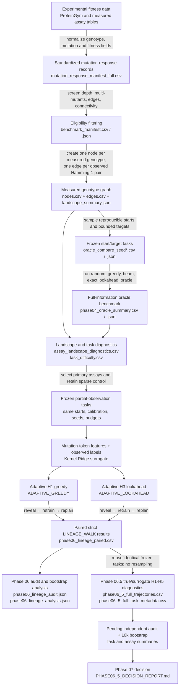

# GraphWalks Project Checkpoint — Phase 06.5

> Read-only project checkpoint prepared after the Phase 06.5 full computation completed. Phase 06 remains **DONE**; Phase 07 remains **HOLD / NOT STARTED**.

# A. Executive summary

## PROJECT QUESTION

Can multi-step planning outperform greedy mutation selection when optimizing proteins over experimentally measured fitness landscapes? More specifically, does lookahead still help when fitness is hidden, measurements are acquired sequentially, and every query must be a legal one-mutation continuation of the current genotype?

## PROJECT PIPELINE

- ✅ **01 Scope Freeze**
- ✅ **02 Fitness Benchmark**
- ✅ **03 Landscape Graph**
- ✅ **04 Oracle Validation**
- ✅ **05 Landscape Characterization**
- ✅ **06 Partial Observation**
- ▶ **06.5 Planning Opportunity / Information Bottleneck Audit**
- ⏸ **07 Learned Planner**
- ○ **08 338lib External Case**
- ○ **09 Ablations / Paper**

> **Status update:** Phase 06.5’s full computation finished while this checkpoint was being prepared. Phase 06.5 remains marked **RUNNING** because its independent audit, final statistical analysis, and decision report have not yet been completed.

**CURRENT PHASE:**  
06.5 — Planning Opportunity / Information Bottleneck Audit

**CURRENT LIVE ACTIVITY:**  
The full diagnostic computation has exited successfully. It generated 6,160 trajectory records for 154 frozen tasks, comparing true-fitness and Ridge-surrogate policies at horizons H1–H5. No Phase 06.5 computation process is currently active.

**CURRENT SCIENTIFIC QUESTION:**  
Does the frozen Phase 06 benchmark contain real multi-step planning opportunity, and—where it does—is that opportunity lost because of surrogate/local-ranking error rather than absence of useful paths?

**CURRENT BLOCKER / WAITING CONDITION:**  
The raw run is complete, but it has not yet passed the independent full-output audit or the final 10,000-iteration paired bootstrap analysis.

**NEXT DECISION:**  
After audited analysis, decide whether Phase 07 has a defensible rationale for a predeclared surrogate-limited regime, or whether the benchmark/task design should be expanded before building a learned planner.

---

# B. Complete phase-by-phase story

| Phase | Scientific question | Why this phase was needed | Input data | Method / experiment | Primary comparison | Primary metric | Main result | Evidence level | Important negative / failure result | Output artifacts | Exit gate | Status |
|---|---|---|---|---|---|---|---|---|---|---|---|---|
| **01 Scope Freeze** | What exact scientific claim should GraphWalks test? | Without a fixed question, later choices could drift toward unrelated protein prediction, ligand-response, or favorable benchmark selection. | Existing project goals and available experimental protein-fitness datasets. | Defined protein fitness/activity and sequential mutation optimization as the primary scope; defined Hamming-1 graph moves and valley terminology; separated GraphWalks from the biosensor track. | Multi-step planning versus greedy mutation selection under equal constraints. | A clear, falsifiable primary endpoint and explicit non-claims. | Scope was frozen around measured fitness landscapes and legal sequential mutation walks. | **Design-level, established.** | Ligand-specific response, docking, open-world protein generation, and universal protein optimization were explicitly excluded from the primary claim. | `MASTER_PLAN.md`; scope definitions embedded in benchmark and report code. | Primary question, graph semantics, and non-claims fixed. | ✅ DONE |
| **02 Fitness Benchmark** | Which experimental assays contain enough measured combinatorial variation to support graph walking? | Many ProteinGym assays contain only single mutants or disconnected measurements; those can support prediction but not sequential graph planning. | Standardized mutation-response data, primarily ProteinGym experimental fitness records. | Standardized assay records; computed mutation-depth, Hamming-1 edge, connectivity, and fitness-availability diagnostics; assigned eligibility classes. | `GRAPHWALK_ELIGIBLE` versus `PREDICTION_ONLY`. | Number of variants, multi-mutant depth, Hamming-1 edges, connected components, usable fitness fraction. | 217 assays were assessed; 69 met the broad graph-walk eligibility rules, while 148 were prediction-only. | **Verified data-engineering eligibility result.** | Eligibility does not mean every assay is suitable for a strong local-walk benchmark; sparse assays can still be technically eligible. | `work/results/benchmark_manifest.{csv,json}`; `work/build_fitness_benchmark.py`. | Reproducible manifest and explicit inclusion/exclusion reasons. | ✅ DONE |
| **03 Landscape Graph** | Can measured genotypes be represented as valid mutation graphs for planning? | Oracle and adaptive policies require explicit legal actions rather than arbitrary jumps between sequences. | Eligible assay records with measured genotype and fitness. | Built one node per measured genotype; connected two nodes only when they differ by exactly one observed mutation; generated node, edge, component, depth, and local-neighborhood diagnostics. | Legal Hamming-1 walks versus disconnected or unsupported transitions. | Node/edge counts, connected-component size, degree, mutation depth, local maxima/minima. | The graph API and invariants worked across eligible assays; SPG1/Wu and GFP were used as early smoke graphs, followed by the four primary Phase 04–06 assays. | **Verified graph-construction result.** | Many measured variants are isolated; an assay can be large yet offer little usable sequential connectivity. | `work/build_fitness_graph.py`; per-assay `nodes.csv`, `edges.csv`, and `landscape_summary.json`. | Graph edges and components reproducible; illegal transitions excluded. | ✅ DONE |
| **04 Oracle Validation** | Does multi-step planning have any advantage when the full measured landscape is known? | A hidden-fitness experiment would be uninterpretable if the underlying graph had no planning opportunity even with perfect information. | Four observed assays; 3 seeds per assay; 50 starts per seed; 600 paired task records. | Compared random, greedy, beam, exact bounded lookahead, and oracle under shared full-information constraints. Corrected all methods to allow stopping before maximum horizon. | Exact lookahead versus greedy under full information. | Terminal-fitness regret to bounded oracle; normalized regret; IQR-standardized paired gain; clustered CI over starts. | Corrected exact lookahead reached the bounded oracle and beat greedy on locally trapped tasks in all four studied assays. There were 123/600 reproducible `VALLEY_REQUIRED` records. | **PRELIMINARY scientific evidence; formally audited benchmark.** | Not universal: many ties, four assays only, and full-information success says nothing about hidden-fitness learnability. The pre-closeout forced-continuation implementation was unfair and had to be corrected. | `work/results/PHASE04_ORACLE_REPORT.md`; `phase04_oracle_summary.{csv,json}`; `work/run_oracle_benchmark.py`. | Equal stopping semantics, zero audit errors, paired results, conservative claims. | ✅ DONE |
| **05 Landscape Characterization** | How do graph connectivity, task geometry, and observability differ across assays? | Phase 04 showed opportunity under perfect information, but assay structure could determine whether partial-observation planning is feasible. | All 600 corrected Phase 04 records plus graph/component diagnostics. | Joined task difficulty, bounded target, valley geometry, start degree, component size, and assay connectivity; classified assay suitability. | Connected primary landscapes versus sparse negative/control landscape. | Largest-component fraction, isolated fraction, greedy failure, valley-task fraction, task-level normalized regret. | A4 and F7YBW8 were well connected; D7PM05 was moderately connected; GCN4 was retained as a sparse negative/control case with 95.5% isolated nodes and a 57/2,638 largest component. | **Verified characterization; cross-assay inference explicitly exploratory, N=4.** | No ruggedness law was established. Correlations over four assays—even values near ±1—were not treated as general evidence. | `work/results/PHASE05_LANDSCAPE_REPORT.md`; `assay_landscape_diagnostics.csv`; `task_difficulty.csv`. | Benchmark-quality classes and Phase 06 assay roles made explicit. | ✅ DONE |
| **06 Partial Observation** | Does deeper planning still help when fitness is hidden and must be learned sequentially? | Phase 04’s oracle advantage could disappear when actions depend on an imperfect surrogate. This is the deployable-information problem. | 154 frozen starts across A4, D7PM05, F7YBW8, and GCN4; 74 `VALLEY_REQUIRED`, 80 `NO_VALLEY_REQUIRED`; fixed calibration, seeds 1–3, and budgets 10/20/50/100. | Strict no-repeat `LINEAGE_WALK`; same mutation-token Ridge for H1 and H3; reveal, retrain, replan after each query; execute only the first planned action. | `ADAPTIVE_GREEDY` H1 versus `ADAPTIVE_LOOKAHEAD` H3, paired on task, calibration, seed, budget, features, and model. | Normalized regret to `BUDGETED_WALK_ORACLE`; best-fitness trajectory; strict executed-lineage valley success; task-clustered paired bootstrap. | 7,392 records and 1,848 exact H1/H3 groups passed audit. No pooled H3 advantage. At budget 100, H3 helped A4 and F7YBW8, harmed D7PM05, and was inconclusive/tie-heavy on GCN4. | **Verified within this four-assay benchmark; generalization not established.** | D7PM05 showed significant H3 harm and short dead-end trajectories. H3 did not provide stable pooled or valley-specific benefit and did not improve strict valley crossing overall. | `work/results/PHASE06_LINEAGE_REPORT.md`; `phase06_lineage_analysis.json`; `phase06_lineage_audit.json`; `phase06_lineage_paired.csv`; `work/run_lineage_walk.py`. | All invariants and paired audits pass; positive and negative assays retained; Phase 07 gate evaluated conservatively. | ✅ DONE |
| **06.5 Diagnostic Audit** | Is Phase 06 limited by absent true planning opportunity, poor surrogate information, wrong horizon, or graph/actionability constraints? | A learned planner is justified only if deeper planning has true value that the current surrogate cannot capture. Otherwise additional model complexity would not address the real problem. | Exactly the same 154 Phase 06 tasks, starts, calibration sets, graphs, seeds, budgets, and lineage constraints. No replacement sampling. | Evaluation-only `TRUE_FITNESS_POLICY_DIAGNOSTIC` H1–H5; same-Ridge surrogate H1–H5; exact terminal-fitness receding-horizon controls; local legal-neighbor ranking; downhill/recovery decomposition; target-specific actionable-valley audit. | TRUE H>1 versus TRUE H1, then true opportunity versus realized surrogate gain task by task. | Normalized-performance delta; paired task bootstrap; task-weighted micro and equal-assay macro estimates; top-1/top-3 local ranking; local regret; actionable-valley status. | **Raw computation completed:** 154 tasks, 6,160 trajectory rows, H1–H5 for two policy types and four budgets; run metadata reports all TRUE rows exact. Scientific conclusions remain pending audit and analysis. | **Method gate verified; full scientific result pending.** | Raw completion is not an audited result. No Phase 07 conclusion may be drawn until duplicate/missing-task, paired-group, path, and statistical checks pass. | `work/run_phase06_5_diagnostics.py`; `audit_phase06_5_diagnostics.py`; `analyze_phase06_5_diagnostics.py`; `report_phase06_5_diagnostics.py`; `PHASE06_5_METHOD_GATE.md`; raw full outputs; expected `PHASE06_5_DECISION_REPORT.md`. | Independent audit, 10,000-iteration analysis, Q1–Q5 answers, and decision report all complete. | ▶ RUNNING — computation finished, postprocessing pending |

## Scientific logic connecting the phases

1. **Scope was fixed** so the project could not drift toward an easier but different prediction problem.
2. **Assays were screened** because sequential planning requires measured multi-mutant connectivity.
3. **Graphs were constructed** to define legal mutation actions.
4. **Perfect-information planning was tested first** to establish that useful lookahead paths exist at all.
5. **Landscape structure was characterized** to distinguish connected planning benchmarks from sparse controls.
6. **Fitness was then hidden** and H1/H3 were compared with exactly the same surrogate, isolating the effect of planning horizon.
7. **Phase 06.5 now separates opportunity from information:** it asks whether Phase 06 failed because the Ridge surrogate could not identify useful paths, or because deeper paths had little true value under the strict benchmark.

---

# C. Actual data flow



The important changes of representation are:

- **Raw assay table → standardized records:** heterogeneous source columns become common genotype, mutation, and fitness fields.
- **Records → graph:** sequences become nodes and observed one-mutation differences become legal edges.
- **Graph → tasks:** a start, calibration set, target provenance, seed, and budget are frozen.
- **Tasks → adaptive trajectories:** only queried fitness values become visible; each action changes the current genotype.
- **Trajectories → paired summaries:** policy seeds are averaged within task, then tasks are used as the bootstrap unit.
- **Phase 06 → Phase 06.5:** the benchmark is not changed; only evaluation controls and diagnostics are added.

---

# D. Phase 06 algorithmic flow

## Generic schematic task

Consider an abstract measured graph:

```text
             B
            /
Start S — A — C — D
       \
        E
```

Each line is a legal observed Hamming-1 mutation edge. The letters are schematic node identifiers; no biological fitness values are implied.

### 1. Select the starting genotype

A start is drawn from the predeclared eligible task set before policy execution. Its assay, task ID, target provenance, calibration set, policy seeds, and budgets are frozen so H1 and H3 receive the same task.

### 2. Supply initial calibration information

The policy receives the frozen start-only calibration observations. These contain the measured fitness labels that are legal to reveal at query zero, including the start context.

Calibration attainment is recorded separately. If calibration already reaches a target threshold, that is `initially_solved`, not a policy success.

### 3. Keep all other fitness values hidden

The graph topology and mutation identities define possible actions, but fitness labels for unqueried nodes remain hidden from the adaptive policy.

The budgeted oracle and Phase 06.5 TRUE controls may use hidden fitness **only for evaluation**.

### 4. Train Ridge

Observed genotypes are represented by binary mutation-token features. A Kernel Ridge model with the frozen alpha is fitted to the currently observed genotype–fitness pairs.

H1 and H3 use exactly the same:

- features;
- calibration labels;
- Ridge model;
- hyperparameters;
- task;
- seed;
- budget.

### 5. Generate legal actions

At current genotype `S`, legal candidates are:

- measured graph neighbors of `S`;
- exactly Hamming-1 away;
- not previously queried;
- reachable without teleporting.

Previously observed nodes cannot be revisited.

### 6. H1 greedy action

H1 predicts each legal neighbor and chooses the one with the highest predicted terminal fitness after one step.

```text
S → argmax predicted_fitness(neighbor)
```

### 7. H3 lookahead action

H3 explores legal, no-repeat paths up to three actions from the current genotype. It scores each candidate path by the Ridge-predicted fitness of its terminal node.

```text
S → n1 → n2 → n3
score = predicted_fitness(n3)
```

The frozen Phase 06 implementation uses beam width 16 and deterministic tie-breaking.

### 8. Execute only the first action

Even if H3 plans `S → A → C → D`, it executes only `S → A`.

The rest of the planned path is not automatically followed.

### 9. Reveal true measured fitness

After moving to `A`, its experimentally measured fitness is revealed and added to the observed data.

### 10. Retrain the surrogate

Ridge is refitted using the expanded observed set.

This is essential: H3 is model-predictive/receding-horizon planning, not one fixed three-step route.

### 11. Replan from the new current genotype

`A` becomes the current node. Legal unqueried Hamming-1 neighbors are regenerated, and H1 or H3 plans again from `A`.

```text
observe A
   ↓
retrain Ridge
   ↓
recompute legal actions from A
   ↓
choose and execute one next action
```

### 12. Stop the run

A trajectory stops when:

- the requested query budget is exhausted;
- no legal unqueried Hamming-1 continuation exists;
- or an evaluation condition permits a shorter completion.

Requested and actual budgets are both retained. Early termination is a scientifically meaningful consequence of path selection, especially in D7PM05.

### 13. Calculate `best_fitness_seen`

At every query:

```text
best_fitness_seen(q)
    = max(fitness of all calibration and queried nodes through q)
```

It is not necessarily the fitness of the final current genotype.

### 14. Calculate regret

The primary reference is the evaluation-only `BUDGETED_WALK_ORACLE`: the best true measured fitness reachable from the same start under the same legal-walk budget.

A convenient normalized-performance form is:

```text
normalized_performance
    = (best_fitness_seen - start_fitness)
      / (budgeted_oracle_fitness - start_fitness)
```

when the denominator exceeds the predefined numerical tolerance.

Equivalent normalized regret is:

```text
normalized_regret = 1 - normalized_performance
```

Undefined denominators remain NA with a reason rather than being silently set to zero.

### 15. Determine strict valley crossing

A strict Phase 06 valley-crossing success requires all of the following:

1. the task retained original Phase 04 `VALLEY_REQUIRED` provenance;
2. the **executed** lineage contains a strictly downhill true-fitness transition;
3. the same executed lineage later recovers to the task target fitness;
4. the success occurs after policy queries, not merely in calibration.

A predicted downhill action, an unexecuted planned branch, or a different observed branch does not count.

---

# E. Science so far

## WHAT WE KNOW

- Some measured protein-fitness graphs contain genuine multi-step opportunity under full information.
- Exact bounded lookahead can beat greedy selection when greedy is locally trapped.
- Full-information opportunity does not guarantee partial-observation success.
- Under strict hidden-fitness `LINEAGE_WALK`, H3 has assay-dependent effects:
  - positive at larger budgets in A4 and F7YBW8;
  - significantly harmful in D7PM05;
  - inconclusive and saturation-heavy in GCN4.
- The pooled Phase 06 H3-versus-H1 intervals all include zero.
- The current H3 terminal-fitness objective can select short dead-end trajectories.
- GCN4 is structurally sparse: most measured nodes are isolated, so it is valuable primarily as a control/observability case.
- The Phase 06.5 full computation covered all 154 frozen tasks and reports exact TRUE H1–H5 trajectories.

## WHAT WE DO NOT KNOW

- Whether a statistically supported subset has TRUE H>1 opportunity after the final Phase 06.5 audit.
- Whether Ridge local-action ranking is the principal reason adaptive H3 fails to capture such opportunity.
- Whether H3 is the appropriate horizon, or whether H2, H4, or H5 is better in specific regimes.
- Whether true opportunity is concentrated in budget-feasible actionable valleys.
- Whether an uncertainty-aware or learned planner would improve results without introducing leakage or overfitting.
- Whether findings generalize beyond these four assays.
- Whether the assay-specific patterns constitute stable protein-landscape regimes rather than benchmark-specific outcomes.

## WHAT HAS BEEN CONTRADICTED / NOT SUPPORTED

- **Universal planning superiority:** not supported.
- **Pooled partial-observation H3 advantage:** not supported.
- **Stable advantage specifically on `VALLEY_REQUIRED` tasks:** not supported.
- **Improved strict valley-crossing success from H3:** not supported.
- **A four-assay ruggedness law:** not supported.
- **The original claim that GCN4 lookahead suffered a true terminal loss under Phase 04:** contradicted; it arose from unequal forced-continuation semantics.
- **The previously quoted count of 132 Phase 04 valley records:** not reproduced; the audited count is 123/600.
- **A direct causal claim that surrogate error explains Phase 06 failures:** not yet established.

## Relationship among Phases 04, 06, and 06.5

### Phase 04: opportunity under perfect information

Phase 04 asked:

> If all measured fitness values were known, could lookahead outperform greedy search?

Answer: **yes, on some tasks.** This established that the graph topology can contain useful multi-step routes.

### Phase 06: realized performance under hidden fitness

Phase 06 asked:

> Can the same planning idea exploit those routes when it sees only calibration and queried fitness values?

Answer: **not reliably.** H3 helped some assays, hurt another, and had no pooled advantage.

### Phase 06.5: cause of the discrepancy

Phase 06.5 asks:

> Under the exact Phase 06 walk semantics, how much deeper-planning opportunity remains if the planner is given true fitness, and how much of it does Ridge capture?

This distinguishes absent opportunity from an information/model bottleneck.

---

# F. Why Phase 06.5 exists

## Case A — opportunity exists, but the surrogate cannot exploit it

```text
TRUE H>1 > TRUE H1
SURROGATE H>1 ≈ or < SURROGATE H1
```

**Interpretation:**  
The legal graph and task contain useful deeper paths, but the current observed information or Ridge local ranking does not identify them.

**Potential consequence:**  
A carefully scoped Phase 07 may be justified—for example, an uncertainty-aware planner, improved information acquisition, or better local ranking—provided the regime is predeclared and leakage is prevented.

## Case B — little true deeper-planning opportunity

```text
TRUE H>1 ≈ TRUE H1
```

**Interpretation:**  
Even a true-fitness receding-horizon policy gains little from deeper planning under the frozen starts, budgets, and strict lineage constraints.

**Potential consequence:**  
Do not build a more complicated planner. Expand or redesign the benchmark/tasks first.

## Case C — opportunity exists only in a subset

```text
TRUE H>1 > TRUE H1
only for particular assays, budgets, or task geometries
```

**Interpretation:**  
GraphWalks is a regime-specific method, not a universal optimizer.

**Potential consequence:**  
Define that regime prospectively—for example by connectivity, actionable valley geometry, or horizon—and validate it separately before Phase 07.

This causal fork is the central scientific purpose of Phase 06.5.

---

# G. Current live job status

## Status classification

# **FINISHED, WAITING FOR POSTPROCESSING**

The full computation finished while this report was being prepared.

| Item | Observed state |
|---|---|
| Active Phase 06.5 jobs | **0** |
| Active Phase 06.5 process/shell | **0** |
| Completed job | `graphwalks-phase06-5-full-v1` |
| Main command | `run_phase06_5_diagnostics.py` with frozen Phase 06 CSV, H1–H5, exact-search cap 5,000,000, Ridge alpha 1.0, beam width 16 |
| Task/assay stage | All 154 frozen tasks across A4, D7PM05, F7YBW8, and GCN4 completed |
| Latest completed checkpoint | Full raw TRUE and surrogate H1–H5 trajectory generation |
| Trajectory output | 6,160 rows; 121,349,266 bytes |
| Task metadata | 154 rows; 19,765 bytes |
| Run metadata | 154 tasks, H1–H5, 6,160 records, all TRUE rows exact |
| Output completion time | 2026-09-26 13:40:52 +08:00 |
| Supervisor verification | 2026-09-26 13:41:09 +08:00 |
| CPU activity now | None expected; process exited successfully |
| Output still growing | No; outputs are final for the completed raw run |
| Error detected | No runtime error reported; supervisor says `process_exit_and_success_criteria_verified` |
| ETA | **ETA NOT RELIABLY ESTIMABLE** for postprocessing because it has not begun under this read-only request |

A supervisor-state caveat: the shared `.claude/CURRENT_TASK.json` is concurrently carrying unrelated CL-bench state, and its serialized list still places the completed GraphWalks job under `running_jobs`. The individual job state and supervisor report both unambiguously say **completed**. No project files were changed to reconcile this during the read-only checkpoint.

---

# H. Current Phase 06.5 gate

Completion means verified scientific outputs, not merely existing code.

- [x] **Full diagnostic run completes**  
  Supervisor verified successful process exit.

- [~] **Raw output integrity check**  
  Basic counts and run JSON checked: 154 task metadata rows, 6,160 trajectories, expected horizons, all TRUE rows reported exact. Independent recomputation remains pending.

- [ ] **No duplicate/missing task audit**  
  The 154-row metadata count is correct, but the independent key-level audit has not run on full outputs.

- [ ] **Paired-group audit**  
  Expected 3,696 frozen H1/H3 task × budget × seed comparisons have not yet been independently verified.

- [ ] **Final 10,000-iteration bootstrap analysis**  
  Analysis code and pilot validation exist; the full analysis has not run.

- [ ] **Task-weighted micro summary**  
  Pending full analysis.

- [ ] **Equal-assay macro summary**  
  Pending full analysis.

- [ ] **True-fitness horizon comparison**  
  Raw H1–H5 trajectories exist; paired scientific summaries are pending.

- [ ] **Surrogate local-decision analysis**  
  Raw local-decision events exist; final aggregation is pending.

- [ ] **Actionable-valley analysis**  
  Target-specific metadata exists; budget-stratified aggregation and audit are pending.

- [ ] **Assay diagnosis table**  
  Pending audited analysis.

- [ ] **Q1–Q5 decision gate**  
  Pending.

- [ ] **`PHASE06_5_DECISION_REPORT.md` finalized**  
  Report generator exists, but the full-data report has not been generated or validated.

Therefore, Phase 06.5 is **computationally finished but scientifically incomplete**.

---

# I. Five decision questions

| Question | Current evidence | Evidence needed to close it |
|---|---|---|
| **Q1 — Does a meaningful TRUE H>1 planning-opportunity subset exist?** | **PENDING.** Raw TRUE H1–H5 outputs exist and are reported exact, but no full paired bootstrap result has been produced. | Compare each TRUE H2–H5 policy against TRUE H1 by task, assay, budget, and valley status; require paired within-assay intervals rather than isolated positive tasks. |
| **Q2 — Where true opportunity exists, is failure primarily attributable to local surrogate/ranking error?** | **PENDING.** Phase 06 shows uncaptured and harmful H3 behavior, but that alone does not establish its cause. | Relate TRUE opportunity to realized surrogate gain, legal-neighbor top-1/top-3 quality, rank of the true best action, local action regret, and downhill recovery failures. |
| **Q3 — Is planning opportunity concentrated in `PHASE06_ACTIONABLE_VALLEY` tasks?** | **PENDING.** Original valley provenance exists, and target-specific actionability has been computed in raw metadata. | Audit exact original target recovery and compare actionable-valley tasks with non-valley and unresolved tasks under each budget. |
| **Q4 — What horizon is appropriate?** | **PENDING.** H1–H5 raw trajectories are complete. | Produce paired H2/H3/H4/H5-minus-H1 estimates, task-weighted and equal-assay weighted, including assay-specific intervals and adverse cases. |
| **Q5 — Is there a defensible rationale for a learned or uncertainty-aware Phase 07 planner?** | **PENDING.** Phase 06 alone did not pass this gate. | Q1 must establish true opportunity in a defined regime, and Q2 must show that current information or surrogate ranking fails to capture it. Graph limitation or absent opportunity would not justify Phase 07. |

No Q1–Q5 answer should be treated as final until the full audit and paired analysis pass.

---

# J. Next steps as a decision tree

```text
Phase 06.5 audit and analysis finish
        |
        +-- TRUE H>1 opportunity exists
        |       |
        |       +-- Surrogate fails to capture it
        |       |       |
        |       |       └── Phase 07 may be justified for the
        |       |           predeclared information-limited regime:
        |       |           uncertainty-aware acquisition, better local
        |       |           ranking, or a learned planner
        |       |
        |       +-- Surrogate already captures it
        |               |
        |               └── Improve or validate the fixed planning objective
        |                   before adding a learned model
        |
        +-- Little TRUE planning opportunity
        |       |
        |       └── Do not build a more complicated planner;
        |           expand or redesign tasks/benchmarks first
        |
        +-- Opportunity exists only in a subset
                |
                └── Define a regime-specific GraphWalks method
                    and prospectively validate that regime
                    rather than claiming universal optimization
```

## Where 338lib enters

338lib is a later external case study, not a source for changing the current benchmark after seeing results. It should enter only after the Phase 06.5 gate has identified a defensible method or regime.

A later 338lib evaluation would need to:

1. reproduce existing 338lib results from code;
2. determine whether its measured genotypes support the same legal graph API;
3. apply the frozen evaluation definitions where the data permit;
4. avoid inventing missing round-0 or library-baseline measurements;
5. serve as external validation rather than a favorable replacement for the current four assays.

Phase 08 remains **NOT STARTED**.

---

# K. Compact file map

| File | What it is | Why you would open it |
|---|---|---|
| `MASTER_PLAN.md` | Canonical scientific pipeline, phase definitions, and exit gates. | To understand the project’s intended order and what “done” means for each phase. |
| `PROGRESS.md` | Human-readable summary of verified results through Phase 06. | To see the latest closed scientific conclusions without reading raw outputs. |
| `STATUS.md` | High-level project health and explicit established/non-established claims. | To orient quickly across GraphWalks and the repository’s other research track. |
| `work/results/benchmark_manifest.csv` | Assay-level eligibility and graph-support diagnostics. | To see which experimental assays could support graph walks and why others were excluded. |
| `work/results/experiment_registry.csv` | Append-oriented experiment registry covering benchmark runs and evaluation fields. | To trace registered experimental configurations and results. It currently contains 9,856 rows, including 2,400 pre-existing unstaged legacy rows that must not be normalized or overwritten. |
| `work/results/PHASE04_ORACLE_REPORT.md` | Main corrected full-information oracle report. | To understand the evidence that deeper paths can outperform greedy search when fitness is known. |
| `work/results/phase04_oracle_summary.{csv,json}` | Machine-readable Phase 04 paired summaries. | To inspect assay/stratum effect estimates and confidence intervals. |
| `work/results/PHASE05_LANDSCAPE_REPORT.md` | Connectivity and benchmark-quality interpretation. | To understand why A4/F7YBW8 are well connected, D7PM05 is moderate, and GCN4 is a sparse control. |
| `work/results/PHASE06_LINEAGE_REPORT.md` | Main hidden-fitness strict-lineage scientific report. | To understand the definitive Phase 06 H1-versus-H3 findings and limitations. |
| `work/results/phase06_lineage_paired.csv` | Frozen 7,392-row Phase 06 scientific input to Phase 06.5. | To inspect the exact tasks, seeds, budgets, methods, paths, and metrics reused by the diagnostic audit. |
| `work/results/phase06_lineage_analysis.json` | Phase 06 paired bootstrap analysis. | To inspect the pooled and assay-specific effect estimates. |
| `work/results/phase06_lineage_audit.json` | Phase 06 independent integrity audit. | To verify path, pairing, budget, oracle, and valley invariants. |
| `work/results/PHASE06_5_METHOD_GATE.md` | Validated design and pilot evidence for Phase 06.5. | To understand the TRUE H1–H5 control, exactness requirements, actionable-valley definition, and expected full-run scale. |
| `work/run_phase06_5_diagnostics.py` | Full Phase 06.5 raw diagnostic runner. | To inspect TRUE and Ridge H1–H5 receding-horizon semantics. |
| `work/audit_phase06_5_diagnostics.py` | Independent full-output auditor. | To see which provenance, path, exactness, pairing, and reproduction conditions must pass next. |
| `work/analyze_phase06_5_diagnostics.py` | Task/assay aggregation and paired bootstrap analysis. | To inspect micro/macro statistics, opportunity labels, local metrics, and GCN4 saturation calculations. |
| `work/report_phase06_5_diagnostics.py` | Decision-report generator. | To inspect how audited evidence maps to assay diagnoses and Q1–Q5. |
| `work/results/phase06_5_full_trajectories.csv` | Newly completed 6,160-row raw diagnostic output. | To inspect every TRUE/surrogate horizon trajectory and local-decision event. This is not yet an audited scientific result. |
| `work/results/phase06_5_full_task_metadata.csv` | Newly completed 154-row task geometry and target metadata. | To inspect original-target reachability, actionable valleys, component sizes, and path counts. |
| `work/results/PHASE06_5_DECISION_REPORT.md` | Expected final Phase 06.5 scientific report. | This will be the primary document for the Phase 07 decision; it has not yet been finalized from the full run. |

---

# L. Current research health check

| Area | Rating | Reason |
|---|---|---|
| **Research question clarity** | **GOOD** | The primary question, legal-action semantics, comparison, and non-claims are explicitly frozen. |
| **Data pipeline** | **GOOD** | Experimental records are transformed through reproducible eligibility, graph, task, and trajectory stages with preserved provenance. |
| **Benchmark validity** | **GOOD** | Full-information and hidden-fitness benchmarks were independently audited, and Phase 06.5 reuses the exact frozen tasks rather than resampling favorable cases. |
| **Statistical design** | **GOOD** | Policies are paired on task, calibration, seed, and budget; seeds are averaged within task; inference uses task-clustered bootstrap, task-weighted micro, and equal-assay macro summaries. |
| **Planning signal** | **MIXED** | Phase 04 shows full-information opportunity, but Phase 06 has no pooled H3 advantage and contains both positive assays and a significant adverse assay. |
| **Surrogate quality** | **UNKNOWN** | Local ranking metrics have been generated, but the full Phase 06.5 aggregation needed to identify an information bottleneck is still pending. |
| **Phase 07 justification** | **PENDING** | It depends on audited evidence that true deeper-planning opportunity exists in a defined regime and that the current surrogate fails to exploit it. |
| **Reproducibility** | **GOOD** | Frozen inputs, deterministic tests, explicit exactness flags, supervisor metadata, raw outputs, audit scripts, and versioned reports are present. |

## Overall assessment

The project is scientifically healthy because negative results were retained and implementation defects were corrected rather than hidden. The main uncertainty is no longer whether the current H3 policy has a universal advantage—it does not—but whether a narrower, genuine planning regime exists that is blocked by information quality.

The Phase 06.5 raw computation has now finished successfully. Phase 06 remains **DONE**, Phase 06.5 remains **open pending postprocessing**, and Phase 07 remains **HOLD / NOT STARTED**.
